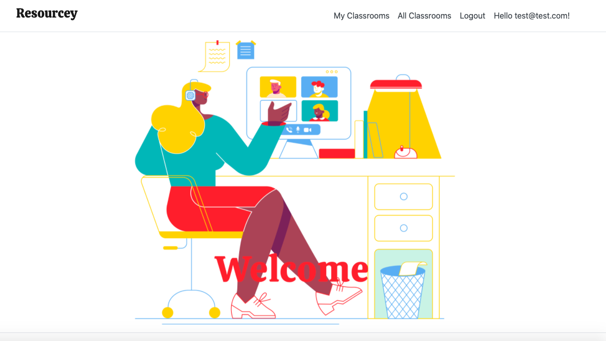

<h1 align="center"><strong>Resourcey</strong></h1>

<h4 align="center"><em>The place where the resources go</em></h4>

----

<h4 align="center">Created: 8/24/2020</h4>
<h4 align="center">Last Updated: 8/27/2020</h4>

---
## Description
 This is a great application developed to help learners and teachers. 
 
 **For Students:** This app allows you to visit virtual classrooms to view resources other students and teachers have found to be helpful for specifc parts of the curriculum. Think: helpful youtube tutorials. You are also able to add resources that you have found to be helpful to specific sections of any classroom. 
 
 **For Teachers:** This app will allow you to create a virtual resource classroom. Here, you can take your syllabus and divide it into as many sections as you'd like. In each section you can add helpful resources for your students. With this app, hopefully less of your time can be spent on finding resources for your curriculum, that you often will teach multiple semster or terms, and more time on instruction.
 
## User Stories

As a user I want to be able to create an account and log-in so that I can user the program.

### Teacher-User

* As a teacher-user I want to be able to create a virtual classroom, so that I can house resources for my students. 
* As a teacher-user I want to be able to create sections in my classroom so that I can organize the resources and so that student-users are able to locate what they need easily.
* As a teacher-user I want to have full CRUD functionality for both the classrooms and resources uploaded to it, so that I can control what my student-users see. 
* As a teacher-user I want to be able to add resources to specific sections for my student-users to access. 

### Student-User

* As a student-user I want to access classes created by teacher-users so that I can utilize the resources that have been added to a specific classroom. 
* As a student-user I want to be able to add resources to a section so that I can share resources I have found helpful with other users. 
* As a student-user I want to be able to Edit and Delete resources I have added to section. 

## Setup/Installation Requirements
### Required Software
* [.NET Core 2.2](https://dotnet.microsoft.com/download/dotnet-core/2.2)
* [MySQL Community Server and MySQL Workbench](https://dev.mysql.com/downloads/)

* Clone the GitHub repository by running `git clone https://github.com/TeresaRosinski/Resourcey)` in the terminal.
  * Or download the ZIP file by clicking on `Code` then `Download ZIP` from this repository.

* open the program in a code editor
* you will need [.NET](https://dotnet.microsoft.com/download/dotnet-core/2.2) installed to run this program 
* then install dotnet script REPL by typing 'dotnet tool installl -g dotnet-script' in the command line
* type dotnet build in the command line to compile the code
* create a .gitignore file and store the bin and obj folders in .gitignore
* type dotnet run in the command line to run the program

## Importing and Updating the Database

* MySql must be installed on your device
* To connect the database type in the command line: dotnet ef migrations add Initial 
* To update the database type in the command line: dotnet ef database update    
* The database will automatically be populated with the data in the BusinessApiContext file

## Known Bugs

* n/a

## Support and contact details

----

|   |  | |  |
|:-----:|:-----:|:-----:|:-----:|
| [**TeresaRosinski**](https://github.com/TeresaRosinski) | [**sarakane**](https://github.com/sarakane) | [**christinereina**](https://github.com/christinereina) | [**HBeinstein**](https://github.com/HBeinstein) |
| Teresa Rosinski | Sara Kane | Christine Augustine | Hannah Beinstein |

## Technologies Used

* Visual Studio Code
* C#
* MySQL Workbench
* Entity Framework
* .NET Core
* Identity 
* [DrawKit](https://www.drawkit.io/)

### License

Copyright (c) 2020 **_Christine Augustine, Sara Kane, Hannah Beinstein and Teresa Rosinski_**

This software is licensed under the MIT license.
